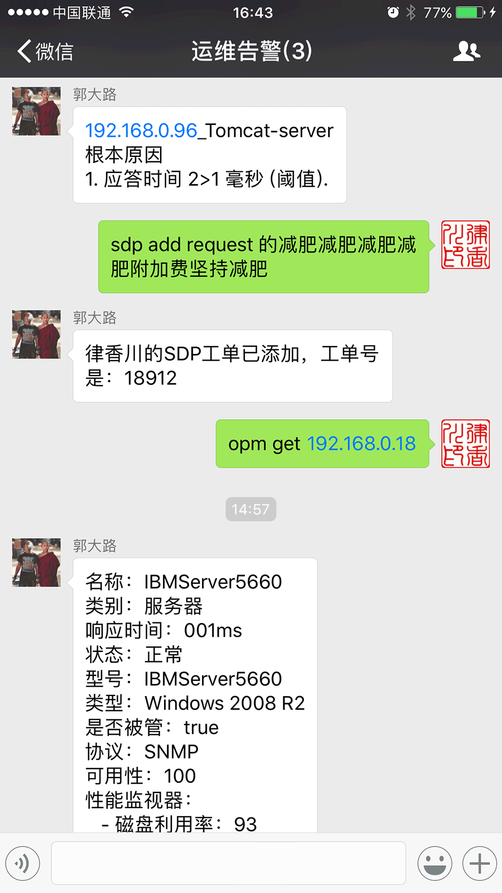

# WeChatAgent
A ME-WeChat demo based on itchat

### Prerequests:

- python 2.7
- [itchat]. (https://github.com/littlecodersh/ItChat) install: `pip install -U itchat`

### Usage:

1. open conf.py to set up your Wechat group name to be used， and other infomation if you need.
2. run `python wxagent.py` to start login to your WeChat account with qrcode scaning. It will start auto replaying and open localhost 6601(default) port.
3. In your selected WeChat group input `sdp add request your_ticket_description` to add a ticket to ServiceDesk Plus.
4. In your selected WeChat group input `opm get your_device_ip_or_hostname` to get device infoation from OpManager.
5. In ME product, add a 'execute program' action, e.g. `msg.bat $MONITORNAME  "$RCAMESSAGE"` , and then associate this aciton to monitored object. If the action triggered, you will receive the alert message in you WeChat group.

### NOTE

This is just a POC demo, it is far away to be an out-of-box program.

### TODO

1. Use single thread to handle http request to avoid thread block.
2. More details of SDP ticket adding process.
3. exception handle 
4. more possible aciton with ME products
5. ... 

Welcome to fork and PR :)

### video

<https://v.qq.com/x/page/e03995n6h9q.html>

<embed src="https://imgcache.qq.com/tencentvideo_v1/playerv3/TPout.swf?max_age=86400&v=20161117&vid=e03995n6h9q&auto=0" allowFullScreen="true" quality="high" width="480" height="400" align="middle" allowScriptAccess="always" type="application/x-shockwave-flash"></embed>

### Screenshot:

<!--  -->

